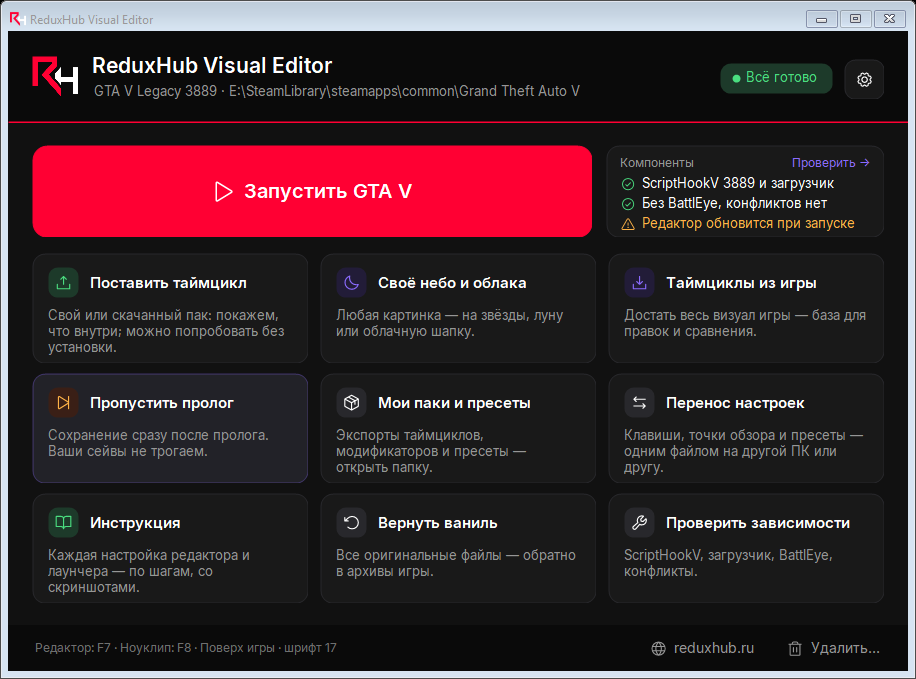
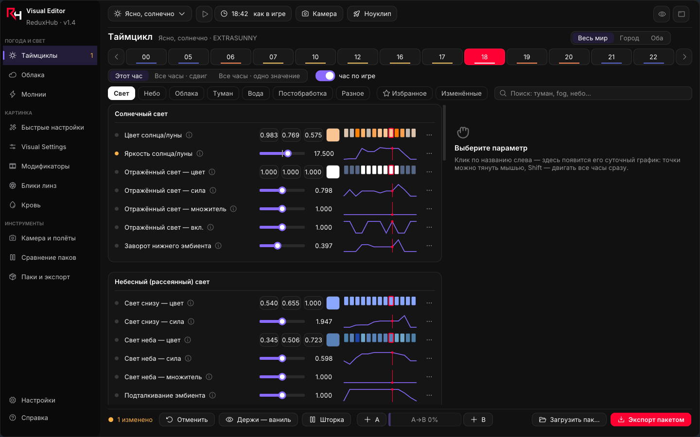
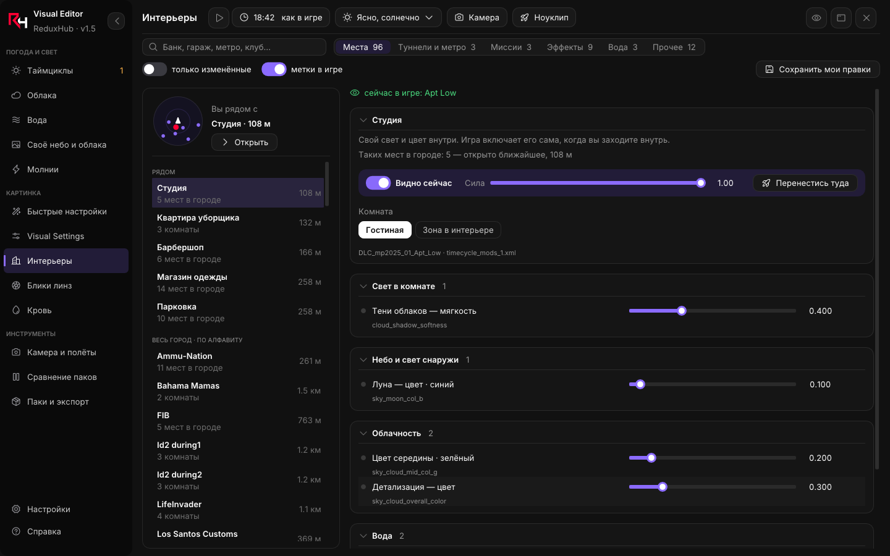
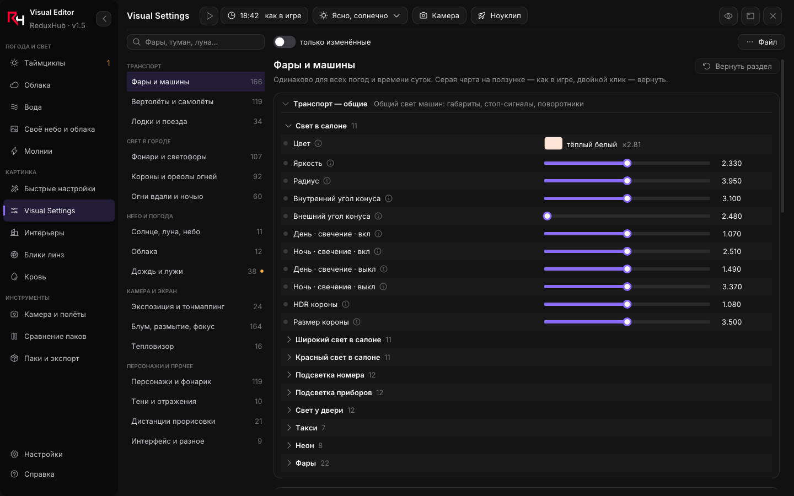
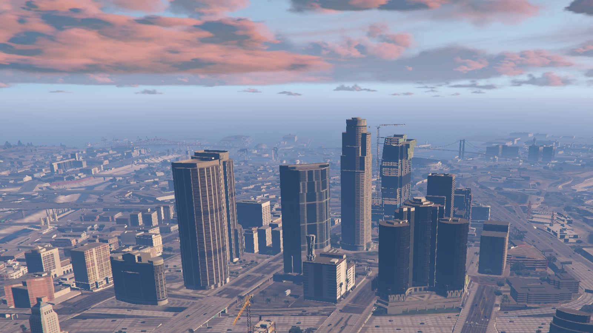

# ReduxHub Visual Editor

Живой редактор визуала **GTA V Legacy**: погода и свет, облака, вода, своё небо, свет в интерьерах, блики, камера для роликов — всё меняется прямо в игре, без перезапуска. Один файл, русский и английский интерфейс.

**[⬇ Скачать последнюю версию](https://github.com/ReduxHubDev/ReduxHubVisualEditor/releases/latest/download/ReduxHubVisualEditor.exe)** · [Все версии](https://github.com/ReduxHubDev/ReduxHubVisualEditor/releases) · [Сайт reduxhub.ru](https://reduxhub.ru)

## Как установить

1. Скачайте `ReduxHubVisualEditor.exe` и запустите. Программа спросит, куда себя установить, и создаст ярлыки.
2. Лаунчер сам найдёт игру и поставит всё нужное (ScriptHookV и загрузчик скачиваются с официального сайта автора).
3. Нажмите **«Запустить GTA V»**, в сюжетном режиме — **F7**. Всё.

Обновления приходят сами: в лаунчере появится «Доступна версия — Обновить», файл проверяется по контрольной сумме и заменяется на месте.

**Нужно:** GTA V Legacy (сборка 3889), Windows 10/11 64-бит. Только сюжетный режим — в GTA Online не работает.

## Что умеет

- **Таймциклы** — свет, небо, туман, вода и постобработка для каждой погоды и часа; сравнение «до / после», смешивание двух вариантов.
- **Быстрые настройки** — готовые стили («Белые ночи», «Тёплый закат», «Без дождя»…) в один клик.
- **Облака и своё небо** — цвета облаков по времени суток, любая картинка на звёзды, луну или облака.
- **Вода** — волны, дождь, лужи.
- **Интерьеры** — свет внутри зданий: найдите место в списке или подойдите к нему в игре.
- **Visual Settings, блики линз, молнии, кровь.**
- **Камера и полёты** — свободная камера, ноуклип, плавный пролёт по точкам для роликов.
- **Автосохранение** — правки не пропадут при выходе из игры.
- **Паки** — сохранить свой визуал в папку, поставить чужой, попробовать пак без установки.

| | |
|---|---|
|  |  |
|  |  |

## Безопасно ли это

Редактор меняет визуал в памяти игры, файлы игры не трогаются, пока вы сами не поставите пак через лаунчер. Оригинальные файлы сохраняются — «Вернуть ваниль» в лаунчере возвращает всё как было.

## Исходный код

Исходный код закрыт. Здесь публикуются только готовые сборки и список изменений ([CHANGELOG.md](CHANGELOG.md)). Использованные сторонние компоненты и их лицензии — в [THIRD_PARTY.md](THIRD_PARTY.md).

Вопросы и ошибки — во вкладке [Issues](https://github.com/ReduxHubDev/ReduxHubVisualEditor/issues) или на [reduxhub.ru](https://reduxhub.ru).

---

**English.** A live visual editor for **GTA V Legacy** (build 3889, story mode): timecycles, clouds, water, custom sky, interior lighting, lens flares and a cinematic camera — changes show up in game instantly. One file, Russian and English UI. [Download the latest version](https://github.com/ReduxHubDev/ReduxHubVisualEditor/releases/latest/download/ReduxHubVisualEditor.exe), run it, press «Start GTA V» and then **F7** in game. Updates install in place. The source code is closed; this repository hosts releases only.

*Grand Theft Auto V is a trademark of Take-Two Interactive / Rockstar Games. This project is not affiliated with or endorsed by them.*
